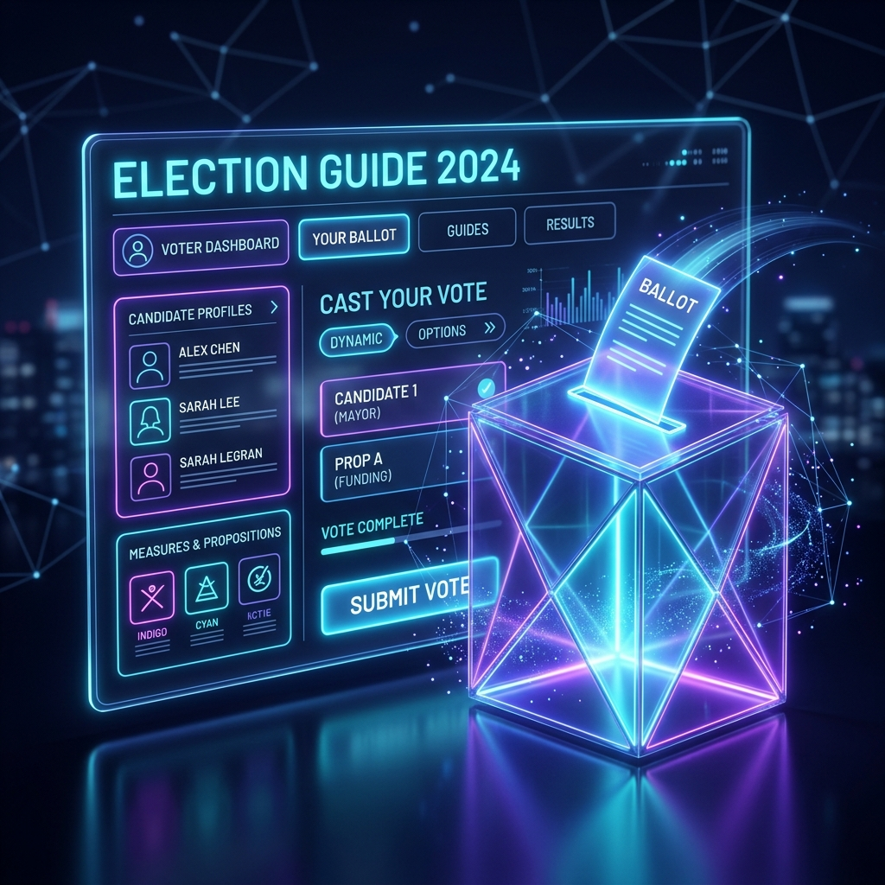

# 🗳️ Election Process Assistant

An interactive, AI-powered civic education platform designed to empower citizens through every stage of the electoral journey. From voter registration to the ballot box, **Election Process Assistant** provides personalized, accessible, and authoritative guidance powered by Google Services.



## 🌟 Core Features

### 📅 Election Timeline Explorer
An interactive visual roadmap covering every phase of the election cycle:
- **Phase Tracking**: From Candidacy Filing to Inauguration.
- **Dynamic Dates**: Integration with the Google Civic Information API for jurisdiction-specific timing.
- **Calendar Reminders**: One-click "Add to Calendar" for all critical deadlines.

### 🤖 Gemini-Powered Q&A Assistant
A conversational interface allowing citizens to ask complex civic questions in plain language:
- **Civic Grounding**: Powered by `gemini-2.0-flash` with strict non-partisan guardrails.
- **Multilingual Support**: Real-time translation for 100+ languages.
- **Authoritative Sources**: Responses cite official portals like vote.gov and state SOS sites.

### ✅ Personalized Voter Checklist
A step-by-step roadmap tailored to the user's jurisdiction:
- **Progress Tracking**: Dynamic progress bar as tasks are completed.
- **Jurisdiction Aware**: Steps auto-generated based on user address.
- **Persistent State**: Progress saved locally and synced via Firebase (for authenticated users).

### 📍 Polling Place Finder
Locate the nearest stations with ease:
- **Integrated Maps**: Search and visualize polling locations using Google Maps.
- **Accessibility Info**: Details on wheelchair access and site-specific hours.
- **Directions**: Instant navigation support.

## 🛠️ Technology Stack

- **Frontend**: React 18+ (Vite + TypeScript)
- **Styling**: Vanilla CSS (Premium Design System, Glassmorphism, Dark Mode)
- **Animations**: Framer Motion
- **Icons**: Lucide React
- **State Management**: Zustand (with persistence)
- **Backend/Auth**: Firebase (Auth, Firestore, Hosting, FCM)
- **AI Layer**: Google Gemini API (`gemini-2.0-flash`)
- **Data Layer**: Google Civic Information API

## 🚀 Getting Started

### Prerequisites
- Node.js (v18+)
- npm or yarn

### Installation
1. Clone the repository:
   ```bash
   git clone git@github.com:a-man77/election_virtual.git
   cd election_virtual
   ```
2. Install dependencies:
   ```bash
   npm install
   ```
3. Set up your environment variables (`.env`):
   ```env
   VITE_FIREBASE_API_KEY=your_key
   VITE_FIREBASE_AUTH_DOMAIN=your_domain
   VITE_GEMINI_API_KEY=your_gemini_key
   VITE_GOOGLE_MAPS_API_KEY=your_maps_and_civic_key
   ```
4. Run the development server:
   ```bash
   npm run dev
   ```

## 🛡️ Security & Accessibility
- **WCAG 2.2 AA Compliance**: Semantic HTML, ARIA labels, and focus management.
- **Non-Partisan Commitment**: AI grounding ensures factual civic information without political bias.
- **Secure Auth**: Integrated with Google Identity Services via Firebase.

---
*Developed as a next-generation civic tool powered by Google Advanced Agentic Coding.*
